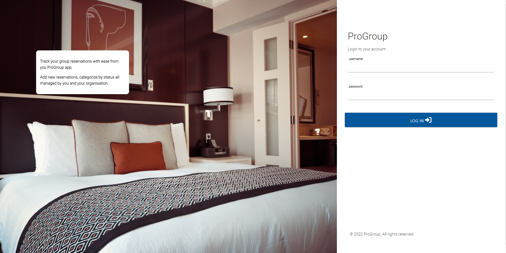
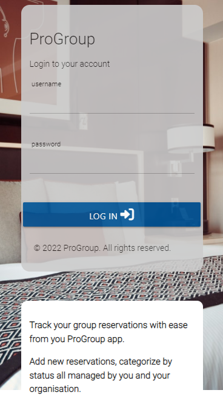
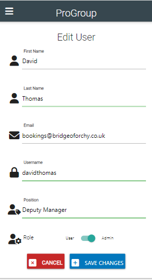
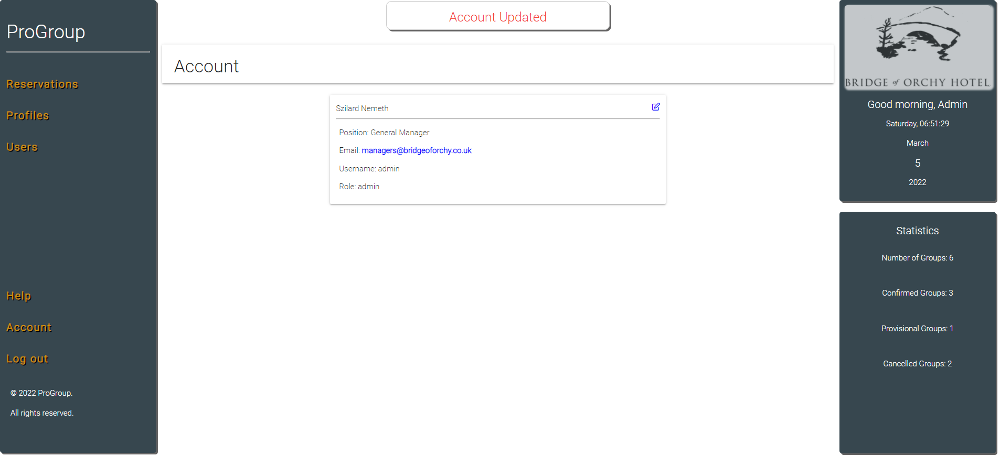
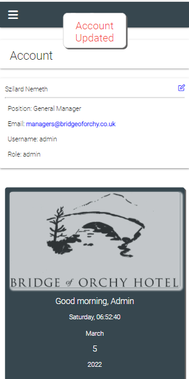

# ProGroup Group Reservation Manager
ProGroup is a website that allows hotels to keep track and organize their group reservations.   
Users will be able to create/update/delete new Group Profiles and New Reservations based on the Profiles.   
Users also able to see basic statistics and send email to the owner of the website.  
There are two type of users: user and admin.  
Users are able to create/update and delete profiles and reservations but not able to add new users.   
Admin will be able to add new users.   
Login for admin: username: admin password:   
Login for user: username: nikolett password:   
<br>

**View the live site [here](https://progroup-app.herokuapp.com/)**


# Table of Contents
- [Project overview](#project-overview)
- [UX](#ux)
  * [Strategy](#strategy)
    + [Project Goal](#project-goal)
    + [User experience](#user-experience)
      - [Target audience](#target-audience)
      - [User requierements and expectations](#user-requierements-and-expectations)
  * [Structure](#structure)
    + [Website pages](#website-pages)
    + [Code structure](#code-structure)
    + [Database](#database)
    + [Conceptual Database](#conceptual-database)
    + [MongoDB Database Information](#mongodb-database-information)
  * [Scope](#scope)
    + [User Stories](#user-stories)
    + [User Stories Website Owner](#user-stories-website-owner)
  * [Skeleton](#skeleton)
    + [Wireframes](#wireframes)
  * [Surface](#surface)
    + [Color Palette](#color-palette)
    + [Typography](#typography)
- [Features](#features)
  * [Existing features](#existing-features)
    + [Feature One Navigation](#feature-one-navigation)
      - [Description feature one](#description-feature-one)
      - [User stories feature one](#user-stories-feature-one)
    + [Feature Two Main page](#feature-two-main-page)
      - [Description feature two](#description-feature-two)
      - [User stories feature two](#user-stories-feature-two)
    + [Feature Three Login](#feature-three-login)
      - [Description feature three](#description-feature-three)
      - [User stories feature three](#user-stories-feature-three)
    + [Feature Four Reservations](#feature-four-reservations)
      - [Description feature four](#description-feature-four)
      - [User stories feature four](#user-stories-feature-four)
    + [Feature Five Profiles](#feature-five-profiles)
      - [Description feature five](#description-feature-five)
      - [User stories feature five](#user-stories-feature-five)
    + [Feature Six Users](#feature-six-users)
      - [Description feature six](#description-feature-six)
      - [User stories feature six](#user-stories-feature-six)
    + [Feature Seven Help](#feature-seven-help)
      - [Description feature seven](#description-feature-seven)
      - [User stories feature seven](#user-stories-feature-seven)
    + [Feature Eight Acount](#feature-eight-account)
      - [Description feature eight](#description-feature-eight)
      - [User stories feature eight](#user-stories-feature-eight)
  * [Features left to implement](#features-left-to-implement)
- [Technologies Used](#technologies-used)
  * [Languages](#languages)
  * [Libraries and other resources](#libraries-and-other-resources)
- [Testing](#testing)
- [APIs](#apis)
  * [Email JS](#email-js)
- [Deployment](#deployment)
  * [Mongo Database](#mongo-database)
  * [Heroku](#heroku)
  * [Local Deployment](#local-deployment)
- [Bugs](#bugs)
- [Credits](#credits)
- [Content](#content)
- [Media](#media)
- [Acknowledgements](#acknowledgements)


# Project Overview
- ProGroup project is a website that allows users to add/edit/delete Group reservation for submission as milestone project 3 as part of the Code Institute - Diploma in Software Development (Full stack) course. The project based on a real world use when the hotel reservation is able to keep track the various groups arriving in the 2022 seasn. 
- The website is deployed using Heroku pages at the following url: [ProGroup](http://progroup-app.herokuapp.com/)
- The repository on GitHub that contains the website source code and assets is available at the following url: [Code Repository](https://github.com/syler11/MS3-ProGroup-App)
- The website was built with a responsive look and feel for desktop, tablet and mobile devices

# UX
## Strategy
### Project Goal
The primary goal of the website from the site 
owners perspective is as follows:
- To create/edit/delete profiles so users can add a reservation
- To allow users reservations to a selected profile
- To allow users modify their reservations and / or profiles
- To allow users delete profiles and / or profiles
- To allow users to send messages to the owners
- To view statistics on the usage of the site

The primary goal of the website from a site users perspective is as follows:
- To allow users reservations to a selected profile
- To allow users modify their reservations and / or profiles
- To allow users delete profiles and / or profiles
- To send messages to the owners
- To view statistics on the usage of the site

### User Experience
#### Target audience
- The applications was designed to use in hospitality setting
- Main target audience are reservations workforce and hotel managers
- Secodnary target audience are owner / sharholders who could look at various statistics

#### User requierements and expectations
- A simple and intuitive navigation system
- Quickly and easily find relevant information
- Links and functions that work as expected
- Good presentation and a visually appealing design regardless of screen size
- An easy way to contact the admin/s
- Simple content that the user can skim read
- Accessibility


## Structure
### Website pages
The website contains 18 pages in a logical structure, information and purpose.
1. Home / Landing Page: The first page the user would see when they access the website before they can login to the site.
2. Login: This page allows the user to login to the website. There was no register page added to the landing page to ensure that only authorised personnel could access the website when given access by one of the admin.
3. Reservations: The first page when user would arrive after successful login. It display all the reservation / navigations and some basic statistics of the exsiting reservations. 
4. Add Reservations: This page allows user add new reservation.
5. Edit Reservations: This page allows user to edit existing reservation.
6. Delete Reservations: This page allows user to delete reservation. 
7. Profiles: This contains all the exisitng group profiles in aplhabetical order.
8. Add Profiles: This page allows user add new profiles.
9. Edit Profiles: This page allows user to edit existing profiles.
10. Delete Profiles: This page allows user to delete profiles. 
11. Users: / admin only / This page lists all existing users but visible only for people with admin role. 
12. Add users: This page allows admin users add new users.
13. Edit users: This page allows admin users to edit existing users.
14. Delete users: This page allows admin users to delete users. 
15. Help: This page allows users to send message to the website owner. 
16. Logout: This link allows the user to logout of the site.
17. 404: The 404 error page is displayed if the user enters an incorrect url when accessing the site.
18. 400, 401, 405 and 500: The error page is displayed if the user encounters an error on the site

### Code structure
- My project is built using a Blueprints structure
- Flask blueprint is a way to organize a flask application into smaller and re-usable application. 
- Just like a normal flask application, a blueprint defines a collection of views, templates and static assets.
- I found the following videos and website to help my project. 
    - https://www.youtube.com/watch?v=Zcw1cgXwKCg
    - https://prettyprinted.com/
- The project is structured as follows
    - authentication: Contains a flask route for authentication for example login, logout
    - errors: Contains a flask route for error pages for example 404
    - reservation: Contains a flask route for Group reservations, adding, editing etc
    - static
      - css (Project style css)
      - pictures (Project and readme images)
      - js (Project javascript structured into individual files)
    - templates: Html templates to match the routes for Authentication, Email, Errors, Profiles, Reservations,  Users and a base.html file
    - profiles: Contains a flask route for profiles code, adding, editing etc 
    - users: Contains a flask route for users code, adding, editing etc 
    - An app.py that setups, creates and runs the application
    - A local env.py(that is not committed to source control) - This ensures passwords and security-sensitive information are stored in environment variables or in files that
    are in .gitignore, and are never committed to the repository

### Database
- The website is a data-centric one with html, javascript, css used with the materialize framework as a frontend
- The backend consists of Python, flask and jinja templates with a database of a mongodb open-source document-oriented database

#### Conceptual Database

### Physical Database Model


#### MongoDB Database Information
- One production database(group_manager) was created to store site information, it contains three collections described below
1. profiles - contains contact information for a group operator

2. reservations - contatins the group operator names and reservation details such

3. users - to store registered user information


## Scope

### User Stories

#### User Stories Existing Users  
The user stories for the website user "regular user" (users with "user" role) are described as follows:
-	User Story 1.1: As a regular user the navigation bar is displayed with a logo on all pages for easy navigation, with a burger menu on mobile devices when user logged in  
-	User Story 1.2: As a regular user the navigation item selected is highlighted  
-	User Story 1.3: As a regular user, when logged out, the home/landing page is the default page and there is an option for Login  
-	User Story 1.4: As a regular user, when logged in, the reservation page is the default page and there are five options with a logo: Profiles, Account, Help, Logout  
-	User Story 1.5: As a regular user if I encounter a route that does not exist, I am navigated to a 404 error page  
-	User Story 2.1: As a regular user I can view a hero image with login on the home/landing page  
-	User Story 2.2: As a regular user I can view four reservations added on the website, with group name, arrival date, los, rooms / pax, board and status  
-	User Story 2.3: As a regular user if I encounter a route that does not exist I am navigated to a 404 error page  
-	User Story 2.4: As a regular user if I encounter an error with the application starting up I am navigated to a 500 error page  
-	User Story 3.1: As a regular user my username must be a minimum of 6 characters, and contain at least one lowercase letter, with no special characters  
-	User Story 3.2: As a regular user my username and / or password must match my confirm username and / or password  
-	User Story 3.3: As a regular user I can log in to my account by providing my username and password and clicking Login and I will be navigated to the reservation page. A username and password must be provided. If the username and/or password entered is incorrectly a relevant message will be displayed  
-	User Story 3.4: As a regular user, when I am logged into the site, and I click Logout I am successfully logged out of the site, and brought to the home/landing page, with the Login option  
-	User Story 4.1: Add Reservation - As a regular user I can add a new reservation by selecting a Group name selection, reservation details, room details, room rates and notes, when clicking on the add reservation the page would redirect to reservations and the new reservation would be added  
-	User Story 4.2: Edit Reservation - As a regular user I can edit an existing reservation by updating any Group name selection, reservation details, room details, room rates and notes, when clicking on the edit reservation the page would redirect to reservations and the new reservation would be updated  
-	User Story 4.3: Delete Reservation - As a regular user I can delete a reservation by confirming I want to delete  
-	User Story 4.4: View Reservation - As a regular user I can view a memory by clicking on a Reservation when additional info would be revealed  
-	User Story 5.1: Add Profile - As a regular user I can add a new profile by typing a Group name, Contact name, Contact Email, Contact Phone, Line Address, City, Post Code, Country, when clicking on the add profile the page would redirect to Profiles and the new reservation would be added  
-	User Story 5.2: Edit Profile - As a regular user I can edit an existing profile by updating any Group name, Contact name, Contact Email, Contact Phone, Line Address, City, Post Code, Country, when clicking on the edit profile the page would redirect to profiles and the profiles would be updated  
-	User Story 5.3: Delete Profile - As a regular user I can delete a profile by confirming I want to delete  
-	User Story 6.1: Help – As a regular user I can send an email to the admin by clicking on the Help button in the navbar and filling up the Name, Email address and Message and click on Send Message  
-	User Story 7.1: Account – As a regular user I can see my account information such as Full Name, Position, Email, Username and Role   
-	User Story 7.2: Edit Account – As a regular user I can edit my account information such as Full Name, Position, Email, Username when clicking on the Save Changes   


### User Stories Website Owner
User Stories Website Owner
The user stories for the website owner(admin user) are described as follows: There is a lot of overlap between the two user types, the admin user however has more administrative rights throughout
-	User Story 1.1: As an admin user the navigation bar is displayed with a logo on all pages for easy navigation, with a burger menu on mobile devices when user logged in  
-	User Story 1.2: As an admin user the navigation item selected is highlighted  
-	User Story 1.3: As an admin user, when logged out, the home/landing page is the default page and there is an option for Login  
-	User Story 1.4: As an admin user, when logged in, the reservation page is the default page and there are five options with a logo: Profiles, Account, Help, Logout  
-	User Story 1.5: As an admin user if I encounter a route that does not exist, I am navigated to a 404 error page  
-	User Story 2.1: As an admin user I can view a hero image with login on the home/landing page  
-	User Story 2.2: As an admin user I can view four reservations added on the website, with group name, arrival date, los, rooms / pax, board and status  
-	User Story 2.3: As an admin user if I encounter a route that does not exist I am navigated to a 404 error page  
-	User Story 2.4: As an admin user if I encounter an error with the application starting up I am navigated to a 500 error page  
-	User Story 3.1: As an admin user my username must be a minimum of 6 characters, and contain at least one lowercase letter, with no special characters  
-	User Story 3.2: As an admin user my username and / or password must match my confirm username and / or password  
-	User Story 3.3: As an admin user I can log in to my account by providing my username and password and clicking Login and I will be navigated to the reservation page. A username and password must be provided. If the username and/or password entered is incorrectly a relevant message will be displayed  
-	User Story 3.4: As an admin user, when I am logged into the site, and I click Logout I am successfully logged out of the site, and brought to the home/landing page, with the Login option  
-	User Story 4.1: Add Reservation - As an admin user I can add a new reservation by selecting a Group name selection, reservation details, room details, room rates and notes, when clicking on the add reservation the page would redirect to reservations and the new reservation would be added  
-	User Story 4.2: Edit Reservation - As an admin user I can edit an existing reservation by updating any Group name selection, reservation details, room details, room rates and notes, when clicking on the edit reservation the page would redirect to reservations and the new reservation would be updated  
-	User Story 4.3: Delete Reservation - As an admin user I can delete a reservation by confirming I want to delete  
-	User Story 4.4: View Reservation - As an admin user I can view a memory by clicking on a Reservation when additional info would be revealed  
-	User Story 5.1: Add Profile - As an admin user I can add a new profile by typing a Group name, Contact name, Contact Email, Contact Phone, Line Address, City, Post Code, Country, when clicking on the add profile the page would redirect to Profiles and the new reservation would be added  
-	User Story 5.2: Edit Profile - As an admin user I can edit an existing profile by updating any Group name, Contact name, Contact Email, Contact Phone, Line Address, City, Post Code, Country, when clicking on the edit profile the page would redirect to profiles and the profiles would be updated  
-	User Story 5.3: Delete Profile - As an admin user I can delete a profile by confirming I want to delete  
-	User Story 6.1: Add User - As an admin user I can add a new user by typing a First name, Last name, Email, Password, Position, and select either user or admin for the Role, when clicking on the add user the page would redirect to Users and the new reservation would be added  
-	User Story 6.2: Edit User - As an admin user I can edit an existing user by updating any First name, Last name, Email, Password, Position, and select either user or admin for the Role, when clicking on the edit profile the page would redirect to profiles and the user would be updated  
-	User Story 6.3: Delete Profile - As an admin user I can delete a user by confirming I want to delete  
-	User Story 7.1: Help – As an admin user I can send an email to the admin by clicking on the Help button in the navbar and filling up the Name, Email address and Message and click on Send Message  
-	User Story 8.1: Account – As an admin user I can see my account information such as Full Name, Position, Email, Username and Role   
-	User Story 8.2: Edit Account – As an admin user I can edit my account information such as Full Name, Position, Email, Username when clicking on the Save Changes   

## Skeleton

### Wireframes
Each wireframe contains three sub images, one for desktop, tablet and mobile

Page | Wireframe | 
------------ | ------------- 
Login | [Desktop/Tablet/Mobile](progroup/static/pictures/wireframes/wireframe_login.png)
Reservations | [Desktop/Tablet/Mobile](progroup/static/pictures/wireframes/wireframe_reservations.png)
Add Reservations | [Desktop/Tablet/Mobile](progroup/static/pictures/wireframes/wireframe_addReservations.png)
Edit Reservations | [Desktop/Tablet/Mobile](progroup/static/pictures/wireframes/wireframe_editReservations.png)
Profiles | [Desktop/Tablet/Mobile](progroup/static/pictures/wireframes/wireframe_profiles.png)
Add Profiles | [Desktop/Tablet/Mobile](progroup/static/pictures/wireframes/wireframe_addProfiles.png)
Edit Profiles | [Desktop/Tablet/Mobile](progroup/static/pictures/wireframes/wireframe_editProfiles.png)
Users | [Desktop/Tablet/Mobile](progroup/static/pictures/wireframes/wireframe_users.png)
Add Users | [Desktop/Tablet/Mobile](progroup/static/pictures/wireframes/wireframe_addUsers.png)
Edit Users | [Desktop/Tablet/Mobile](progroup/static/pictures/wireframes/wireframe_editUsers.png)
Help | [Desktop/Tablet/Mobile](progroup/static/pictures/wireframes/wireframe_help.png)
Help | [Desktop/Tablet/Mobile](progroup/static/pictures/wireframes/wireframe_account.png)

## Surface

### Color palette
There are six main colors what I used throughout of this project.
- #ECECEC - Light grey colour for background
- #37474F - main background clor for the navigation theme
- #CF9109 - Font color for the navigation
- #039be5 - Add Button colour
- #01579B - Save / Search button color
- #F44336 - Delete button color

I choose those colours after testing a number of palettes while making sure the colour palette met accessibility standards.


### Typography
The Roboto font is the main font used throughout the whole website with Sans Serif as the fallback font. This font is from the Google fonts library.

# Features

## Existing Features
### Feature One Navigation
#### Description Feature One
- There is no navigation available for users on the login/landing only the login facility what will be covered in feature three.   
- When the user is logged in there are five options with a logo: Reservations Profiles, Account, Help, Logout (Users can be seen only by admin users).  
-  The navigation for the logged in users ensure the easy use of the website.  

#### Desktop Navigation
  
#### Mobile Navigation
  
#### Desktop 404 Error Page
  
#### Mobile 404 Error Page
  
  
 

#### User Stories Feature One
-	User Story 1.1: As an admin user the navigation bar is displayed with a logo on all pages for easy navigation, with a burger menu on mobile devices when user logged in  
-	User Story 1.2: As an admin user the navigation item selected is highlighted  
-	User Story 1.3: As an admin user, when logged out, the home/landing page is the default page and there is an option for Login  
-	User Story 1.4: As an admin user, when logged in, the reservation page is the default page and there are five options with a logo: Reservations Profiles, Account, Help, Logout (Users can be seen only by admin users)  
-	User Story 1.5: As an admin user if I encounter a route that does not exist, I am navigated to a 404 error page 

### Feature Two Main Page
#### Description Feature Two
* The login/landing page is displayed when the user first accessing the site or i they log out.  
* It displays a hero image and login facilities.

#### Desktop Login Page
  
#### Mobile Login Page
 
#### Desktop Reservation Page
  
#### Mobile Reservation Page
 
#### Desktop 500 Error Page

#### Mobile 500 Error Page


#### User Stories Feature Two
-	User Story 2.1: As an admin user I can view a hero image with login on the home/landing page  
-	User Story 2.2: As an admin user I can view four reservations added on the website, with group name, arrival date, los, rooms / pax, board and status  
-	User Story 2.3: As an admin user if I encounter a route that does not exist I am navigated to a 404 error page  
-	User Story 2.4: As an admin user if I encounter an error with the application starting up I am navigated to a 500 error page  

### Feature Three Login
#### Description Feature Three
- The user cannot register on the website but admin can add users to ensure unauthorized access to sensitive business infromation.
- username is manadtory fields and if they are not entered correctly error message will appear.
- password is manadtory fields and if they are not entered correctly error message will appear.
- After logout the user will be redirected to the login / landing page.

#### Incorrect Username Desktop

#### Incorrect Username Mobile

#### Incorrect Password Desktop

#### Incorrect Password Mobile

#### After logout Desktop
  
#### After logout Mobile
 

#### User Stories Feature Three
-	User Story 3.1: As an admin user my username must be a minimum of 5 characters, and contain lowercase, uppercase letters and numbers, but no special characters  
-	User Story 3.2: As an admin user my username and / or password must match my confirm username and / or password  
-	User Story 3.3: As an admin user I can log in to my account by providing my username and password and clicking Login and I will be navigated to the reservation page. A username and password must be provided. If the username and/or password entered is incorrectly a relevant message will be displayed  
-	User Story 3.4: As an admin user, when I am logged into the site, and I click Logout I am successfully logged out of the site, and brought to the home/landing page, with the Login option  

### Feature Four Reservations
#### Description Feature Four
- Users can add reservation to the database by entering all the mandatory fields and clicking the add reservation button. 
- Users can edit existing reservations by clicking the edit (pen & envelope) icon.
- Users can delete existing reservation by clicking the delete (trash can) icon.
- User can view more details about reservation by clicking on the reservation line itself. (collapsible feature)

#### Add Reservation Desktop

#### Add Reservation Mobile

#### Edit Reservation Desktop

#### Edit Reservation Mobile

#### Delete Reservation Desktop

#### Delete Reservation Mobile

#### View Reservation Desktop

#### View Reservation Mobile


#### User Stories Feature Four
-	User Story 4.1: Add Reservation - As an admin user I can add a new reservation by selecting a Group name selection, reservation details, room details, room rates and notes, when clicking on the add reservation the page would redirect to reservations and the new reservation would be added  
-	User Story 4.2: Edit Reservation - As an admin user I can edit an existing reservation by updating any Group name selection, reservation details, room details, room rates and notes, when clicking on the edit reservation the page would redirect to reservations and the new reservation would be updated  
-	User Story 4.3: Delete Reservation - As an admin user I can delete a reservation by confirming I want to delete  
-	User Story 4.4: View Reservation - As an admin user I can view a memory by clicking on a Reservation when additional info would be revealed 

### Feature Five Profiles
#### Description Feature Five
- Users can add profile to the database by entering all the mandatory fields and clicking the add profile button. 
- Users can edit existing reservations by clicking the edit (pen & envelope) icon.
- Users can delete existing profile by clicking the delete (trash can) icon.
- Users can check existing profiles by navigating to the Profiles page

#### Add Profile Desktop

#### Add Profile Mobile

#### Edit Profile Desktop

#### Edit Profile Mobile

#### Delete Profile Desktop

#### Delete Profile Mobile

#### View Profile Desktop

#### View Profile Mobile


#### User Stories Feature Five
-	User Story 5.1: Add Profile - As an admin user I can add a new profile by typing a Group name, Contact name, Contact Email, Contact Phone, Line Address, City, Post Code, Country, when clicking on the add profile the page would redirect to Profiles and the new reservation would be added  
-	User Story 5.2: Edit Profile - As an admin user I can edit an existing profile by updating any Group name, Contact name, Contact Email, Contact Phone, Line Address, City, Post Code, Country, when clicking on the edit profile the page would redirect to profiles and the profiles would be updated  
-	User Story 5.3: Delete Profile - As an admin user I can delete a profile by confirming I want to delete
-	User Story 5.4: View Profile - As an admin user I can see all the existing Profiles by navigating to the Profiles page

### Feature Six Users
#### Description Feature Six
- Users can add user to the database by entering all the mandatory fields and clicking the add user button. 
- Users can edit existing reservations by clicking the edit (pen & envelope) icon.
- Users can delete existing user by clicking the delete (trash can) icon.
- Users can check existing users by navigating to the users page

#### Add User Desktop

#### Add User Mobile

#### Edit User Desktop

#### Edit User Mobile

#### Delete User Desktop

#### Delete User Mobile

#### View User Desktop

#### View User Mobile

#### User Stories Feature Six
-	User Story 6.1: Add User - As an admin user I can add a new user by typing a First name, Last name, Email, Password, Position, and select either user or admin for the Role, when clicking on the add user the page would redirect to Users and the new reservation would be added  
-	User Story 6.2: Edit User - As an admin user I can edit an existing user by updating any First name, Last name, Email, Password, Position, and select either user or admin for the Role, when clicking on the edit profile the page would redirect to profiles and the user would be updated  
-	User Story 6.3: Delete Profile - As an admin user I can delete a user by confirming I want to delete  
-	User Story 6.4: View users - As an admin user I can see all the existing users by navigating to the Users page

### Feature Seven Help
#### Description Feature Seven
- Users can send emails to the admins directly on the website. 
- The process is straightforward when the full name and email address and message filled the email can be sent with the send button.
- Flash message will confirm that message was sent. 

#### Email Sent Desktop

#### Email Sent Mobile


#### User Stories Feature Seven
-	User Story 7.1: Help – As an admin user I can send an email to the admin by clicking on the Help button in the navbar and filling up the Name, Email address and Message and click on Send Message  

### Feature Eight Account
#### Description Feature Eight
- User can access their basic profile information.
- All information displayed can be update byclicking on the edit (pen & envelope) symbol. 
- All changes executed by the user will be saved. 

#### Account Page Desktop

#### Account Page Mobile

#### Account Updated Desktop

#### Account Updated Mobile


#### User Stories Feature Eight
-	User Story 8.1: Account – As an admin user I can see my account information such as Full Name, Position, Email, Username and Role   
-	User Story 8.2: Edit Account – As an admin user I can edit my account information such as Full Name, Position, Email, Username when clicking on the Save Changes  

## Features left to implement
1. Send email directly to the contact person including the reservation details
2. Send automated email directly on 1st day of each month to contact person whether the group is still go ahead
3. Send automated email to users and admins about group statistic on the 1st day of the month
4. Make calculation such as room,F&B and total revenue
5. Having a report page with preloaded querys for periods
6. Have an invoicing facilites to send ProForma and Final invoice
7. Adding payments to reservations
8. Adding customized items to reservation e.g. Dinner including net value and VAT
9. Summary report to hotel owners in pdf format
10. Make that group_selected variable dynamic (see comment on the reservation/route.py file line 147-152)
 


# Technologies Used

## Languages

- [Html](https://en.wikipedia.org/wiki/HTML)
- [Css](https://en.wikipedia.org/wiki/CSS)
- [Javascript](https://www.javascript.com/)
- [Python](https://www.python.org/)
- [Jinja](https://jinja.palletsprojects.com/en/3.0.x/)

## Libraries and other resources

- [JQuery](https://jquery.com/)
- [Materialize](https://materializecss.com/)
- [Fontawesome](https://fontawesome.com/)
- [Heroku](https://id.heroku.com/)
- [Flask framework](https://flask.palletsprojects.com/en/2.0.x/)
- [Balsamiq](https://balsamiq.com/)
- [Google Font](https://fonts.google.com/)
- [GitHub](https://github.com/)
- [GitPod](https://www.gitpod.io/)
- [MongoDB](https://www.mongodb.com/)
- [Coolors - Color palette generator](https://coolors.co/) 

# Testing
The testing information and results for this project are documented in [TESTING.md](TESTING.md)

# APIs
## Email JS
1. Create an account at emailjs.com 
2. In the integration screen in the emailjs dashboard, note your userid
3. Create an 
 email service in the Email Services section and note the id
4. Create an email template in the Email templates section and note the id
5. Update the script sendEmail.js, method sendMail with your user id, email service id and email template id

# Deployment
There are several applications that need to be configured to run this application locally or on a cloud based service.

## Mongo Database
Mongodb is the database used in the application
1. Create an account at mongodb
2. Create a database cluster
3. Select the cluster, and in the collections section create a database and create 3 collections under the database: reservations, profiles and users
4. In the database access, create a user and allow the user read/write access. Note the username
5. In the network access tab, allow network access from the ip-address of the application connecting to the database
6. In the Databases section click Connect, and select connect your application
7. Note the MONGO_URI, MONGO_DBNAME and user, these parameters are used when deploying locally(env.py file) and deploying on the likes of heroku(config vars)

## Heroku
To deploy this application to Heroku, run the following steps.
1. In the app.py file, ensure that debug is not enabled, i.e. set to True
2. Create a file called ProcFile in the root directory, and add the line <code>web: python app.py</code> if the file does not already exist
3. Create a requirements.txt file by running the command <code>pip freeze > requirements.txt</code> in your terminal if the file doesn't already exist
5. Both the ProcFile and requirements.txt files should be added to your git repo in the root directory
6. Create an account on heroku.com
7. Create a new application and give it a unique name
8. In the application dashboard, navigate to the deploy section and connect your application to your git repo, by selecting your repo
9. Select the branch for example master and enable automatic deploys if desired. Otherwise, a deployment will be manual
10. The next step is to set the config variables in the Settings section
11. Set key/value pairs for the following keys: IP, MONGO_DBNAME, MONGO_URI, PORT, SECRET_KEY
12. Go to the dashboard and trigger a deployment
13. This will trigger a deployment, once the deployment has been successful click on the "Open App" link to open the app
14. If you encounter any issues accessing the build logs is a good way to troubleshoot the issue

## Local Deployment
To run this project locally, you will need to clone the repository
1. Login to GitHub (https://wwww.github.com)
2. Select the repository syler/MS3-ProGroup-App
3. Click the Code button and copy the HTTPS url, for example: https://github.com/syler11/MS3-ProGroup-App.git
4. In your IDE, open a terminal and run the git clone command, for example 

    ```git clone https://github.com/syler11/MS3-ProGroup-App.git```

5. The repository will now be cloned in your workspace
6. Create an env.py file in the root folder in your project, and add in the following code with the relevant key, value pairs, and ensure you enter the correct key values<br>
<code>import os</code><br>
<code>os.environ.setdefault("IP", TO BE ADDED BY USER)</code><br>
<code>os.environ.setdefault("PORT", TO BE ADDED BY USER)</code><br>
<code>os.environ.setdefault("SECRET_KEY", TO BE ADDED BY USER)</code><br>
<code>os.environ.setdefault("MONGO_URI", TO BE ADDED BY USER)</code><br>
<code>os.environ.setdefault("MONGO_DBNAME", TO BE ADDED BY USER)</code><br>
7. Install the relevant packages as per the requirements.txt file
8. Start the application by running <code>python3 app.py</code>

# Bugs

Bugs:

1. Heroku deployment issue:
I kept getting an error message "failed to push some refs to git@heroku.com" which was due that the Procfile was sitting in the templates foolder instead of the root. After a short research and systematic reference back to the CI modules the issue was indetified and resolved. The heroku deployment was succesful afterwards.
2. Glitch with switch button for is_admin function: the label were name for user and admin but code looking for =="on" therefor the function didn't work properly. Attribute was renamed to == "admin" abd fubction is no working fine. 
3. Login page inputfield label and prefill text were overlapping. Issue solved with placeholder=" " within the input tags. 
4. Populate fileds from exisiting collection into another collection
5. Search by dates
6. Database wasn't registering the PAX and Rooms field value as the field was disabled.

# Credits

Credit to https://codeinstitute.net/ for the lesson on email.js  
Credit to https://favicon.io/favicon-converter/ for the Favicon    
Credit to https://websitemockupgenerator.com/ for the Website mockup picture    
Credit to https://fontawesome.com/ for the Icona displayed on the website    
Credit to https://validator.w3.org/ for the html and css validation  
Credit to https://wave.webaim.org/ for accessibility check for the website  
Credit to https://www.emailjs.com/ for email sending functionality for the website   
Credit to https://www.google.com/ for the Lighthouse report  
Credit to https://stackoverflow.com/ for being a valuabe source for various functions
Credit to https://www.youtube.com/watch?v=Zcw1cgXwKCg & https://prettyprinted.com/ for Flask Blueprint structure
Credit to Paul Meeneghan whose project's readme and testing files inspisred me a more extensive documentation


# Content

- Font Awesome (http://fontawesome.com)    
    - The icons used on the site from font awesome

# Media

Photos:

1. hotel_room from Pexels via Pixabay
2. hotel_logo from bridgeoforchy.co.uk website 
3. website-mockup.png from https://websitemockupgenerator.com/

# Acknowledgment

I would like to thank my wife who is also my co-worker who helped me to test the functionalities and gave me ideas how to include certain features. 
I would like to thank my mentor Mo Shami for the guidance and support.
